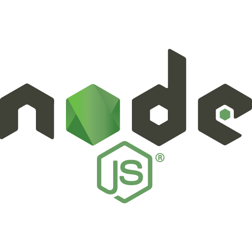

<b> VALERIYA KIM | FULL STACK / BACK END DEVELOPER | NEW YORK </b>

🏰🦁🐍🦅🦡 Columbia Engineering Bootcamp 2023 💻#️⃣🔑Working on building intuitive web apps & writing efficient code 🎮⌨👨🏻‍💻custom keyboards, artisan keycaps, video games, coding, algorithms and food <3  

<small>coding by @skaies

 
 <h3>Languages/Frameworks:</h3> 

 
 <h3>You can reach me here:</h3>

